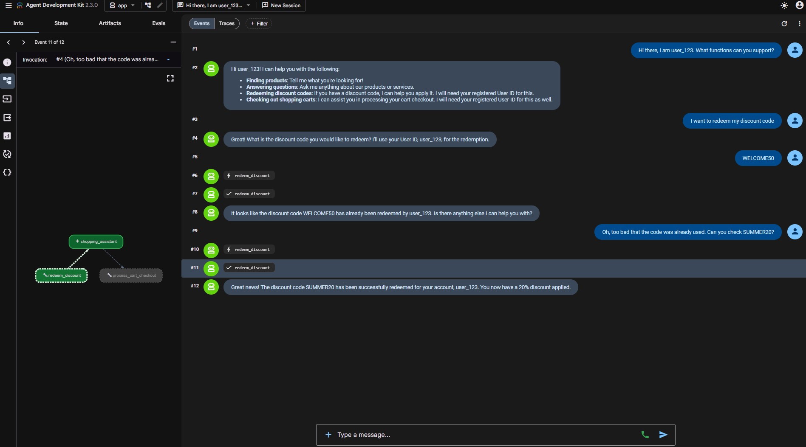

# shopping-assistant
**Author:** Chong Kiat Lim (using Google Antigravity)

Simple ReAct agent
Agent generated with `agents-cli` version `0.5.0`

## Project Structure

```text
shopping-assistant/
├── app/                        # Core agent code
│   ├── agent.py                # Main agent logic, tool registration, and App initialization
│   ├── agent_runtime_app.py     # Vertex AI Agent Runtime wrapper for hosting
│   └── app_utils/              # Logger, telemetry, and typing configurations
├── tests/                      # Testing directory (unit, integration, and evaluation configs)
├── pyproject.toml              # Project configuration and dependency groups
├── uv.lock                     # Locked dependencies for repeatable installs
└── agents-cli-manifest.yaml    # Manifest for agents-cli deployment metadata
```

## Agent Walkthrough (`app/agent.py`)

The main entry point for the shopping assistant logic is located in [agent.py](file:///c:/Users/chonlim/workspace/git_repos_building/agentic_ai/google/courses/IntensiveVibeCodingCourseWithGoogle/Day4_VibeCodingAgentSecurityandEvaluation/codelabs/secure-agent-lab/shopping-assistant/app/agent.py). Here is how the agent workflow is configured:

1. **Discount Redemption Tool (`redeem_discount`)**:
   - This is a Python function that manages a mock database of single-use discount codes (such as `WELCOME50` and `SUMMER20`).
   - It performs strict validation: verifying that the user provided a non-empty `user_id`, checking that the discount code exists, and ensuring the code has not already been used.
   - Once validated, it marks the code as redeemed and locks it to that specific `user_id`.

2. **The Agent Configuration (`Agent`)**:
   - Built using the Agent SDK (`google.adk.agents.Agent`).
   - Configured with a `Gemini` model (initialized with `gemini-2.5-flash` and the api_key).
   - Instructed to act as a retail assistant and to explicitly request a registered user ID before allowing discount code redemptions.
   - Registers the `redeem_discount` function in its `tools` list, making the tool available for ReAct loop execution.

3. **The Root Workflow (`App`)**:
   - The `App` class (`google.adk.apps.App`) defines the root workflow enclosing the shopping assistant agent.
   - It acts as the orchestrator interface that can be launched locally via `agents-cli playground` or packaged for production on Vertex AI.

4. **Cart Checkout Tool (`process_cart_checkout`)**:
   - Handles checkout for user carts stored in the mock `CARTS` database.
   - Computes base totals, validates coupon/discount ownership and single-use constraints (using the `redeem_discount` backend), and generates final order receipts.

## Security & Interception Configuration

This project includes localized agent guardrails and testing gates:
- **Secure Coding Standards ([CONTEXT.md](file:///c:/Users/chonlim/workspace/git_repos_building/agentic_ai/google/courses/IntensiveVibeCodingCourseWithGoogle/Day4_VibeCodingAgentSecurityandEvaluation/codelabs/secure-agent-lab/shopping-assistant/.agents/CONTEXT.md))**: Defines core paved roads including Tool Input Validation, No Shell Execution, and TDD Planning constraints.
- **Interception Hooks ([hooks.json](file:///c:/Users/chonlim/workspace/git_repos_building/agentic_ai/google/courses/IntensiveVibeCodingCourseWithGoogle/Day4_VibeCodingAgentSecurityandEvaluation/codelabs/secure-agent-lab/shopping-assistant/.agents/hooks.json))**: Intercepts tool calls like `run_command` via a `PreToolUse` hook running [validate_tool_call.py](file:///c:/Users/chonlim/workspace/git_repos_building/agentic_ai/google/courses/IntensiveVibeCodingCourseWithGoogle/Day4_VibeCodingAgentSecurityandEvaluation/codelabs/secure-agent-lab/shopping-assistant/.agents/scripts/validate_tool_call.py) to block destructive actions.
- **Custom Semgrep Rules ([rules.yaml](file:///c:/Users/chonlim/workspace/git_repos_building/agentic_ai/google/courses/IntensiveVibeCodingCourseWithGoogle/Day4_VibeCodingAgentSecurityandEvaluation/codelabs/secure-agent-lab/shopping-assistant/.semgrep/rules.yaml))**: Configured via pre-commit to check code changes offline for hardcoded API keys.

## Quick Start

Install `agents-cli` and its skills if not already installed:

```bash
uvx google-agents-cli setup
```

Install required packages:

```bash
agents-cli install
```

Test the agent with a local web server:

```bash
agents-cli playground
```

You can also use features from the [ADK](https://adk.dev/) CLI with `uv run adk`.

## Commands

| Command              | Description                                                                                 |
| -------------------- | ------------------------------------------------------------------------------------------- |
| `agents-cli install` | Install dependencies using uv                                                         |
| `agents-cli playground` | Launch local development environment                                                  |
| `agents-cli lint`    | Run code quality checks                                                               |
| `agents-cli eval`    | Evaluate agent behavior (generate, grade, analyze, and more — see `agents-cli eval --help`) |
| `uv run pytest shopping-assistant/tests` | Run all unit, integration, and security test suites                              |
| `agents-cli deploy`  | Deploy agent to Agent Runtime                                                                |
| `agents-cli publish gemini-enterprise` | Register deployed agent to Gemini Enterprise                    |

## 🛠️ Project Management

| Command | What It Does |
|---------|--------------|
| `agents-cli scaffold enhance` | Add CI/CD pipelines and Terraform infrastructure |
| `agents-cli infra cicd` | One-command setup of entire CI/CD pipeline + infrastructure |
| `agents-cli scaffold upgrade` | Auto-upgrade to latest version while preserving customizations |

---

## Development

Edit your agent logic in `app/agent.py` and test with `agents-cli playground` - it auto-reloads on save.

## Deployment

```bash
gcloud config set project <your-project-id>
agents-cli deploy
```

To add CI/CD and Terraform, run `agents-cli scaffold enhance`.
To set up your production infrastructure, run `agents-cli infra cicd`.

## Observability

Built-in telemetry exports to Cloud Trace, BigQuery, and Cloud Logging.

---

## Final Status

The AI Shopping Assistant agent is successfully secured, evaluated, and deployed in the local development playground environment.

### ADK Playground UI Demonstration


---

## Tech Stacks

The following table summarizes all demonstrated skills and security guardrails implemented throughout the vibe coding sessions:

| Skill / Guardrail | Description |
| :--- | :--- |
| **Tool Call Interception Hook** | Implemented `validate_tool_call.py` hooked via `PreToolUse` in `.agents/hooks.json` to inspect command execution dynamically and block destructive commands (e.g., `rm -rf`). |
| **STRIDE Threat Modeling** | Established a local agent skill `stride-threat-model` to systematically audit system boundaries, entry points, and threats (Spoofing, Tampering, Repudiation, Info Disclosure, DoS, Elevation of Privilege). |
| **TDD Planning Gate** | Appended a strict architectural gate in `CONTEXT.md` requiring security assertions and boundary check designs before initiating any coding. |
| **Secure Discount Code & Checkout** | Enhanced `agent.py` to prevent unauthorized discount code redemptions and cart checkouts by enforcing strict `user_id` validation and discount state checking. |
| **Automated Security Testing** | Wrote an outcome-based security test suite using `pytest` to guarantee that all business rules and access controls hold true against malicious edge cases. |
| **API Key Retrieval Safety** | Fixed API key management by migrating from hardcoded strings to dynamic environment retrieval, verified by custom Semgrep rules in pre-commit git hooks. |
| **Local Playground Hosting** | Hosted and verified the interactive developer workspace using ADK Web Server on custom port `8082`. |
